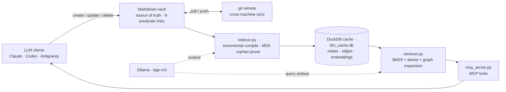

# llm-vault

> A source-grounded MCP memory runtime and Obsidian-compatible vault template for
> LLM agents.
>
> `llm-vault` helps agents keep long-running project memory without silently
> overwriting uncertainty: immutable raw sources, source summaries, decision
> records, contradiction tracking, confidence-aware retrieval, and human review
> queues are first-class parts of the system.

[](LICENSE)
[](https://www.python.org/)

Read this first: [English](#what-is-this) · [한국어 안내](#korean-overview)

## What is this?

`llm-vault` combines an Obsidian-compatible Markdown vault, source-grounded
archival rules, decision records, contradiction preservation, and an MCP memory
runtime backed by DuckDB, BM25, optional Ollama embeddings, and graph expansion.

The core assumption is simple: **LLM output can be wrong by default**. Raw
evidence, citations, uncertainty labels, preserved contradictions, and human
review queues are therefore not optional extras. They are the operating model.

Agents such as Claude, Cursor, Antigravity, and Codex should read
[AGENTS.md](AGENTS.md) before writing to the vault. The full mental model lives in
[00_System/Second Brain Operating Model.md](00_System/Second%20Brain%20Operating%20Model.md).

## Start From A Clean Private Vault

This repository is a framework skeleton plus seed/example knowledge. If you are
turning it into your own private second brain, keep the framework files and
delete the existing seed documents before adding personal memory.

Keep these:

- `00_System/`, `90_Engine/`, `docs/`, `scripts/`
- root docs such as `README.md`, `SETUP.md`, `AGENTS.md`, `LICENSE`
- `.mcp.json.example`, `requirements.txt`, `.gitignore`
- layer `README.md` files and `.gitkeep` placeholders, if present

Delete seed/user-specific content from the knowledge layers:

```bash
find 10_MOC 20_Concepts 30_Projects 40_Decisions \
  50_Source_Summaries 60_Open_Questions 70_Contradictions 80_Reviews \
  -type f -name '*.md' ! -name 'README.md' -delete

find 05_Inbox 06_Raw \
  -type f ! -name 'README.md' ! -name '.gitkeep' -delete
```

Then rebuild the local cache:

```bash
python3 90_Engine/indexer.py --force --embed --report
```

If Ollama is not running yet, omit `--embed` for a BM25-only first pass.

See [SETUP.md](SETUP.md) for MCP client setup and the private/public split. See
[examples/mini-vault](examples/mini-vault) for a tiny source-to-decision demo.

> **이 저장소는 프레임워크 템플릿입니다.** 엔진(`90_Engine/`) + 정책(`00_System/`) +
> 문서/스크립트 + 빈 vault 스켈레톤 + 동작을 보여주는
> [`examples/mini-vault/`](examples/mini-vault/)로 구성됩니다. 실제 개인 지식은 담지
> 않습니다. 자신의 second brain으로 쓰려면 이 템플릿을 복제해 **개인 private 인스턴스**를
> 만들고, 실제 지식은 거기에만 쌓으세요. 경계·운영법은 [SETUP.md](SETUP.md) §8 참조.

## Korean Overview

`llm-vault`는 Obsidian 호환 Markdown vault, 출처 기반(source-grounded) 아카이브 규율,
결정 기록(decision records), 모순 추적(contradiction tracking), 그리고 MCP 기반
메모리 런타임을 결합한 **LLM-native second brain**입니다.

핵심 전제는 **"LLM은 틀릴 수 있다"**([[Hallucination as Default]])입니다. 그래서 이
시스템에서 원본(raw source), 출처 인용, 불확실성 표시, 모순 보존, 사람 검토 큐는
선택이 아니라 필수입니다. 단순한 개념 그래프가 아니라, AI 연구 노트·디버깅 로그·장기
프로젝트 결정·이론 진화·행정 기록·스크린샷·채팅 로그·개인 워크플로우 기록을 모두
포괄합니다.

에이전트(Claude, Cursor, Antigravity 등)는 작업 전 [AGENTS.md](AGENTS.md)를 먼저 읽고,
전체 멘탈 모델은 [00_System/Second Brain Operating Model.md](00_System/Second%20Brain%20Operating%20Model.md)를 따릅니다.

## Layers

| 계층 | 경로 | 역할 |
|------|------|------|
| **아카이브 (Archive)** | `05_Inbox/`, `06_Raw/` | 미처리 인입(05_Inbox, 인덱싱 제외) → 불변 원본(06_Raw, 전문검색 전용·그래프 제외). |
| **위키/지식 (Wiki/Knowledge)** | `20_Concepts/`, `50_Source_Summaries/`, `10_MOC/` | 원본 요약과 내구성 개념 지식, 탐색 지도. |
| **프로젝트 (Project)** | `30_Projects/` | 활성 작업 대시보드. |
| **결정 (Decision)** | `40_Decisions/` | 중요 선택과 근거. 기존 결정은 불변(supersede 방식). |
| **검토 (Review)** | `60_Open_Questions/`, `70_Contradictions/`, `80_Reviews/` | 열린 질문, 모순 보존, 사람 검증 큐. |
| **런타임 (Runtime)** | `90_Engine/` | DuckDB 인덱싱, 하이브리드 검색, MCP 서버. |

데이터 흐름: `05_Inbox/` → `06_Raw/`(불변) → `50_Source_Summaries/` → 해석 계층 갱신 →
검토/모순/질문 라우팅 → `90_Engine/` 재인덱싱. 자세한 그림은
[Second Brain Operating Model](00_System/Second%20Brain%20Operating%20Model.md) 참조.

## Architecture

**Markdown is the source of truth; DuckDB is a derived, regenerable cache.** Clients write
Markdown through MCP tools, the indexer compiles it into a DuckDB graph cache, and the
retriever serves layer/confidence-aware hybrid search back to the clients. The cache
(`ltm_cache.db`) is gitignored and rebuilt per machine — only Markdown syncs across devices.

**Markdown이 진실의 원천, DuckDB는 파생·재생성 가능한 캐시입니다.** 클라이언트는 MCP 도구로
Markdown을 쓰고, 인덱서가 이를 DuckDB 그래프 캐시로 컴파일하며, 리트리버가 계층/신뢰도 인지
하이브리드 검색으로 응답합니다. 캐시(`ltm_cache.db`)는 gitignore라 머신마다 재생성되며, 기기
간에는 Markdown만 동기화됩니다.



> 동시성·프로세스 토폴로지는 **단일 소유자 데몬**(`vault_daemon.py`)이 표준으로 처리합니다 —
> `mcp_server.py`는 데몬의 얇은 프록시이고, 모든 읽기/쓰기가 localhost HTTP로 데몬에
> 포워딩됩니다(in-process DB 경로 없음). 설계는 [docs/DAEMON_DESIGN.md](docs/DAEMON_DESIGN.md).

## Daemon (always-on & startup)

데몬(`vault_daemon.py`)은 **MCP 클라이언트의 첫 요청에 자동 기동**되어 idle 종료 없이
상주합니다(`DAEMON_IDLE_SHUTDOWN` 기본 off). 즉 한 번이라도 클라이언트를 열면 계속 떠 있고,
별도 env(`USE_DAEMON` 등)는 필요 없습니다. `mcp_server.py`는 데몬의 얇은 프록시입니다.

**상시가동 / startup 등록.** 재부팅 직후 클라이언트를 한 번도 안 열어도 데몬이 떠서 주기 git
sync가 돌게 하려면, 로그인 시 데몬을 띄우도록 등록하세요(예시 파일 포함):

- **macOS** — [`scripts/launchd/com.llm-vault-daemon.plist.example`](scripts/launchd/com.llm-vault-daemon.plist.example) (RunAtLoad + KeepAlive)
- **Linux** — [`scripts/systemd/llm-vault-daemon.service.example`](scripts/systemd/llm-vault-daemon.service.example) (Restart=always)
- **Windows** — 시작프로그램(`shell:startup`)에 `pythonw.exe vault_daemon.py` 바로가기/`.cmd`, 또는 작업 스케줄러 '로그온 시' 트리거.

단계별 명령·치환·`SYNC_ENABLED`(데몬이 git 동기화까지 담당)는 [SETUP.md](SETUP.md)의 '데몬' 절.
한 기기에 데몬은 하나(싱글턴)이며 모든 클라이언트가 공유합니다.

## Template ↔ Instance Sync (public ↔ private)

이 프로젝트는 **공개 템플릿**(`llm-vault`, upstream)과 **개인 인스턴스**(`llm-vault-private`,
origin) 두 레포로 운영됩니다. 프레임워크(엔진·문서·정책·스크립트)는 양쪽이 공유하고, 실제
지식은 private에만 쌓입니다(경계·근거는 [SETUP.md](SETUP.md) §8).

두 레포는 **프레임워크 경로만 선택 동기화**합니다 — 양방향 모두 전체 `git merge`가 아니라
필요한 경로만 옮깁니다.

| 방향 | 명령 | 옮기는 것 |
|------|------|-----------|
| private → public | [`scripts/sync-template.sh`](scripts/sync-template.sh) | 큐레이션된 프레임워크 개선만 (allowlist 가드) |
| public → private | [`scripts/pull-framework.sh`](scripts/pull-framework.sh) | upstream 프레임워크 갱신 (`90_Engine`·`docs`·`scripts`·`00_System`·루트 문서) |

> **왜 `git merge upstream/main`이 아닌가.** public은 스켈레톤 + `examples/` 데모, private는
> 실지식 누적이라 두 트리가 구조적으로 분기돼 있습니다. 전체 merge는 (a) private 지식 파일을
> modify/delete 충돌로 끌고 오고, (b) `examples/mini-vault` 데모를 실볼트에 주입해 그래프를
> 오염시킵니다. 그래서 두 스크립트 모두 **지식 계층은 건드리지 않고 프레임워크 경로만** 옮깁니다.

## Getting Started

- 설치, 초기 인덱싱, MCP 클라이언트 연결: [SETUP.md](SETUP.md)
- MCP 도구 명세와 AI memory write 흐름: [docs/MCP_TOOLS.md](docs/MCP_TOOLS.md)
- Antigravity 전용 연결 가이드: [docs/ANTIGRAVITY.md](docs/ANTIGRAVITY.md)
- 왜 이 구조가 필요한지: [docs/WHY_LLM_VAULT.md](docs/WHY_LLM_VAULT.md)
- 작은 데모 vault: [examples/mini-vault](examples/mini-vault)
- 기기 간 git 동기화와 선택적 자동 sync: [SETUP.md](SETUP.md#자동-동기화-선택)

최소 흐름은 다음과 같습니다.

1. Python 의존성 설치
2. Ollama와 `bge-m3` 모델 준비
3. `90_Engine/indexer.py`로 Markdown을 DuckDB 캐시로 컴파일
4. MCP 클라이언트 설정에 `90_Engine/mcp_server.py` 등록

자세한 명령과 OS별 설정 예시는 [SETUP.md](SETUP.md)를 기준으로 보세요.

## Folder Structure

```text
llm-vault/
├── README.md
├── AGENTS.md                  # LLM 에이전트 운영 지침
├── SETUP.md
├── docs/
│   ├── ANTIGRAVITY.md
│   ├── MCP_TOOLS.md
│   └── WHY_LLM_VAULT.md
├── examples/
│   └── mini-vault/             # small runnable source→summary→decision example
├── 00_System/                 # 온톨로지 + second brain 정책
│   ├── Ontology Specification.md
│   ├── Second Brain Operating Model.md
│   ├── Source Policy.md
│   ├── Ingest Policy.md
│   ├── Review Policy.md
│   └── Naming Convention.md
├── 05_Inbox/                  # 미처리 인입 (인덱싱 제외)
├── 06_Raw/                    # 불변 원본 = 진실의 원천 (전문검색 전용, 그래프 제외)
├── 10_MOC/                    # 탐색 지도 (Map of Content)
├── 20_Concepts/               # 내구성 개념 지식
├── 30_Projects/               # 활성 작업 대시보드
├── 40_Decisions/              # 결정 기록
├── 50_Source_Summaries/       # 원본 압축 이해
├── 60_Open_Questions/         # 미해결 질문
├── 70_Contradictions/         # 모순·낡은 가정 보존
├── 80_Reviews/                # 사람 검증 큐
└── 90_Engine/                 # 런타임/인덱스/MCP
    ├── indexer.py
    ├── retriever.py
    ├── mcp_server.py          # MCP stdio 서버 (데몬의 얇은 프록시)
    ├── vault_daemon.py        # 단일 소유자 데몬 (표준; FastAPI/localhost, 자동 기동)
    ├── daemon_client.py       # 데몬 디스커버리 + 경량 HTTP 클라이언트
    ├── vault_sync.py          # 데몬 구동 git 동기화 헬퍼(이벤트 구동)
    └── ltm_cache.db           # local generated cache, ignored by git
```

숫자 접두사는 Obsidian의 자연 정렬과 읽기 순서를 위한 것입니다. 핵심 규칙은
`00_System/Ontology Specification.md`의 9개 술어 헌법과 `00_System/`의 second brain
정책 문서들입니다.

## Daily Workflow

node는 사람이 직접 Markdown으로 작성해도 되고, MCP write 도구로 만들 수도 있습니다.
인입(ingest)의 표준 절차는 [Ingest Policy](00_System/Ingest%20Policy.md)를 따릅니다.

- 사람이 편집한 뒤에는 `sync_vault()` 또는 인덱서 실행으로 캐시를 갱신합니다.
- 에이전트가 메모리를 저장할 때는 `list_nodes()`로 기존 제목을 확인한 뒤
  `create_node()`, `update_node()`, `upsert_edge()`를 사용합니다.
- dangling edge가 생기면 자동 정합이 처리하거나 `reconcile_graph()`로 즉시 정리합니다.
- **모든 source를 concept node로 만들지 않습니다.** 기본 도착지는
  `50_Source_Summaries/`이며, 내구성 지식만 `20_Concepts/`로 승격합니다.
- 검색은 **계층/신뢰도 인지**입니다. `06_Raw/`는 전문검색 전용으로 검색되되 강등되고,
  낮은 신뢰도·폐기 항목도 강등+표기되며, 검토 계층(`60/70/80`)은 기본 검색에서 빠집니다
  (`retrieve_knowledge(..., include_reviews=true)`로 포함). 검토 큐 점검은
  `review_queue()`로. 근거: [[2026-06-18-layer-and-confidence-aware-retrieval]].

node 작성 시 edge predicate는 아래 9개만 허용됩니다(안정적 지식 관계에만 사용).

`requires` · `utilizes` · `implemented_by` · `extends` · `abstracts` · `causes` · `contradicts` · `replaces` · `defines`

## Learn More

- 에이전트 지침: [AGENTS.md](AGENTS.md)
- 설계 이유: [docs/WHY_LLM_VAULT.md](docs/WHY_LLM_VAULT.md)
- 운영 모델: [00_System/Second Brain Operating Model.md](00_System/Second%20Brain%20Operating%20Model.md)
- 정책: [Source Policy](00_System/Source%20Policy.md) · [Ingest Policy](00_System/Ingest%20Policy.md) · [Review Policy](00_System/Review%20Policy.md) · [Naming Convention](00_System/Naming%20Convention.md)
- 온톨로지 헌법: [00_System/Ontology Specification.md](00_System/Ontology%20Specification.md)
- 초기 코퍼스(LLM 멘탈 모델): [10_MOC/Karpathy LLM Framework MOC.md](10_MOC/Karpathy%20LLM%20Framework%20MOC.md)
- 설치와 운영: [SETUP.md](SETUP.md) · MCP 도구: [docs/MCP_TOOLS.md](docs/MCP_TOOLS.md)

## License

MIT License. 자세한 내용은 [LICENSE](LICENSE)를 참조하세요.

## Sources

- [Andrej Karpathy](https://karpathy.ai)
- [Intro to Large Language Models](https://www.youtube.com/watch?v=zjkBMFhNj_g)
- [Let's build the GPT Tokenizer](https://www.youtube.com/watch?v=zduSFxRajkE)
- [Software 2.0 Essay](https://karpathy.medium.com/software-2-0-a64152b37c35)
- [llm.c GitHub](https://github.com/karpathy/llm.c)
- [nanoGPT GitHub](https://github.com/karpathy/nanoGPT)
